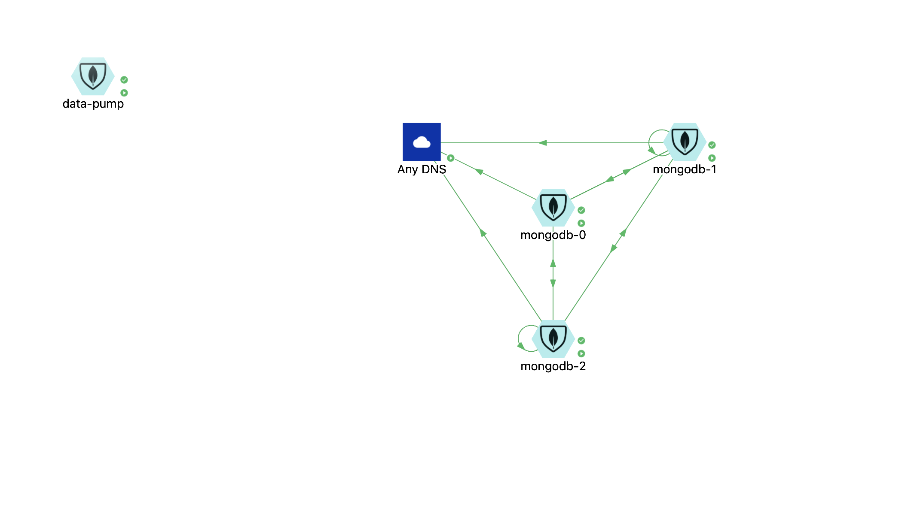
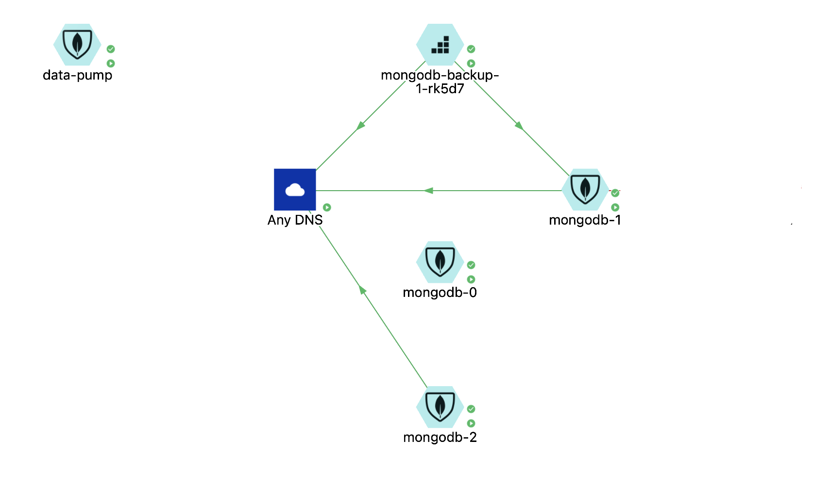

## Deploying RocketChat

This document details the steps required to deploy Rocket.Chat.

### Network Security Policy

Deploy the network security policy in advance to make sure the components in your deployments work as expected:

```console
oc process -f openshift/templates/nsp.yaml \
  -p NAMESPACE=$(oc project --short) | \
  oc apply -f -
```

### Database

Create the database credentials in advance of deploying the stateful set otherwise it will fail with various errors:

```console
oc process -f openshift/templates/mongodb-secrets.yaml| oc apply -f - 
```

Deploy the mongodb `statefullset`. The deployment parameters that vary across environments are stored in a properties file; pass this file to the command below varying the environment name as needed.

```console
oc process -f openshift/templates/mongodb-deploy.yaml \
  --param-file=openshift/mongodb-dev.properties | \
  oc create -f -
```
Watch that all tree pods in the `statefullset` start and verify in the Aporeto console that the cluster can communicate amongst itself.



### Database Backup

Don't leave backups to an afterthought. Set them up as soon as your database is deployed and verified. The backup container project, along with detailed instructions, can be found [here](https://github.com/BCDevOps/backup-container).

Deploy the configuration file that tells the backup container how frequently to backup:

```console
oc process -f openshift/templates/backup-config.yaml| oc apply -f -
```

Deploy the actual backup container:

```console
oc process -f openshift/templates/backup-deploy.yaml| oc apply -f -
```

The backup container will immediately run when deployed. Verify in the Aporeto console that the cluster can communicate amongst itself.



**ProTip 🤓**

Check backups regularity and from time to time practice a restore. Often backups can appear to be running but they're not; they just don't cause errors, which can be misleading.

### Server

The deployment parameters that vary across environments are stored in a properties file; pass this file to the command below varying the environment name as needed.

```console
oc process -f openshift/templates/rocketchat-config.yaml \
  --param-file=openshift/rocketchat-config-dev.properties \
  -p SSO_SHARED_SECRET=$SSO_SECRET | \
  oc apply -f -
```

When creating the administrator account, if you have a username and password in mind you may supply them as parameters to the following command. Otherwise, a password and default username will be assigned.

```console
oc process -f openshift/templates/rocketchat-secrets.yaml| oc create -f -
```

```console
 oc process -f openshift/templates/rocketchat-deploy.yaml \
  --param-file=openshift/rocketchat-dev.properties \
  -p TLS_CERT_PEM="$(cat ./openshift/certificate.pem)" \
  -p TLS_KEY_PEM="$(cat ./openshift/key.pem)" \
  -p TLS_CACERT_PEM="$(cat ./openshift/ca.pem)" | \
  oc apply -f -
```

Note: The three TLS PEM files are not included in the repo; check with a Platform Services team member or Vault for these credentials.

